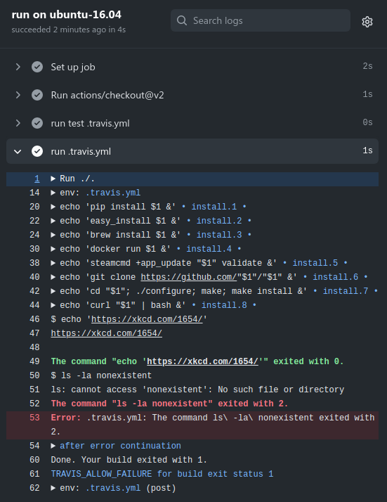

# Run .travis.yml Github Action

[![CI Status][badge.svg]](https://github.com/ktomk/run-travis-yml/actions)

For the [pipelines project][p] there was need to migrate from travis-ci.org
to travis-ci.com (as travis-ci.org is shutting down).

> **Pro-Tip:** Do not migrate from travis-ci.org to travis-ci.com, but
> look for other migration options first.

Turned out it is good to have some more options to execute the `.travis.yml`
based build script as well on Github via Github Actions.

Extracting parts of the open-source interface of Travis-CI from
[`travis-build`][TRAVIS-BUILD] as a *Github Action* to make the
`.travis.yml` more portable to Github w/o changing everything at once
and a smoother migration.

[Example](#example)
| [Usage](#usage)
| [Notes](#notes)
| [Copying](#copying)
| [Resources](#resources)

## Example

[][example]

This projects [`.travis.yml`](.travis.yml) [running as Github Action][example].

<!-- FIXME(tk) stale link, gone after 90 days from 2020-12-12 due to log retention -->
[example]: https://github.com/ktomk/run-travis-yml/runs/1540760369?check_suite_focus=true#step:4:1

## Usage

```yaml
  - name: Run .travis.yml build script
    uses: ktomk/run-travis-yml@v1
    with:
      file: .travis.yml
      stages: |
        install
        script
      allow_failure: false
    env:
      TRAVIS_PHP_VERSION: ${{ matrix.php-versions }}
```

* (*optional*) **Path to `.travis.yml` file** can be specified `with:` `file:`
  (by default `.travis.yml`).
* (*optional*) **Stages to run** can be specified `with:` `stages:` as a space
  separated list (by default [all custom stages][acs] are run).
* (*optional*) **Allow failure** can be enabled `with:` `allow_failure: true`,
  even if the `.travis.yml` file run exits non-zero, it will not fail.
  Double check cache and artifacts configuration for side effects.
  `TRAVIS_TEST_RESULT` environment variable has the scripts exit status.
* **Environment variables** are likely incomplete (some are ported), add
  missing ones or override your own, the `env:` is key.

## Notes
* Lightweight port to support migrating travis-ci build scripts, your
  mileage may vary.
* Running the stage(s) as build script based on the original
  [`travis-build`][TRAVIS-BUILD].
* Custom stages only (no matrix, deployment, after_success etc.), this needs
  additional matrix/actions in your workflow (checkout, VM setup, services,
  caching). Helps to do an actual migration, e.g. reducing matrix on Travis
  first to get build minutes down, the matrix on Github is not affected by
  that.
* Folding supported, Github just has no such nice labels thought.
* Similar on Github for the timing information as nice as the
  one on Travis-CI (the display on Travis CI is generally looking better to
  me, also while the action is running, Github truncates log output).
* First error in script is annotated. Further, following output folded to
  keep things more visible within the Github log viewer.
* Github has no allow-failure option when running action job steps. The
  job-wide [`continue-on-error:`][coe] may help, see
  [actions/toolkit#399][at-399] as well.

## Copying
`AGPL-3.0-or-later` see [COPYING], `MIT` for files from *travis-build* see
[TRAVIS-LICENSE] and `MIT` for files from *Symfony YAML* see [LICENSE].

## Resources
* [travis-ci/travis-build][TRAVIS-BUILD] - .travis.yml => build.sh converter
* [travis-ci/dpl](https://github.com/travis-ci/dpl) - Dpl (dee-pee-ell) is
  a deploy tool made for continuous deployment
* [JoshCheek/travis-environment](https://github.com/JoshCheek/travis-environment
  ) - A repo to reflect on the Travis CI environment
* [Travis to GitHub Actions converter](https://akx.github.io/travis-to-github-actions/
  ) - SPA to convert Travis.yml workflows to GitHub Actions; Python and
  Node.js workflows, contributions welcome; by Aarni Koskela; Dec 2020
* [Migrating From Travis to GitHub Actions](https://markphelps.me/2019/09/migrating-from-travis-to-github-actions/)
  by Mark Phelps; Sep 2019
* [Migrate From Travis CI to GitHub Actions](https://developer.okta.com/blog/2020/05/18/travis-ci-to-github-actions)
  by Brian Demers for Okta; May 2020
* [ktomk/pipelines](https://github.com/ktomk/pipelines) - Command line
  pipeline runner written in PHP

---
[COPYING]: COPYING
[LICENSE]: lib/ktomk/symfony-yaml/Symfony/Component/Yaml/LICENSE
[TRAVIS-LICENSE]: lib/template/TRAVIS-LICENSE
[TRAVIS-BUILD]: https://github.com/travis-ci/travis-build
[acs]: https://github.com/travis-ci/travis-build/blob/master/lib/travis/build/stages.rb#L12-L65
[at-399]: https://github.com/actions/toolkit/issues/399
[badge.svg]: https://github.com/ktomk/run-travis-yml/workflows/CI/badge.svg
[coe]: https://docs.github.com/en/free-pro-team@latest/actions/reference/workflow-syntax-for-github-actions#jobsjob_idcontinue-on-error
[p]: https://github.com/ktomk/pipelines
