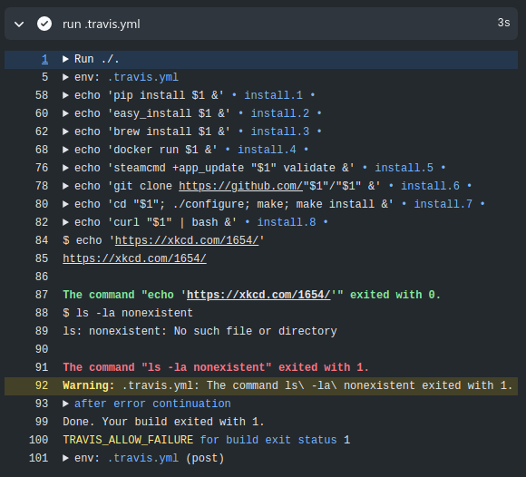
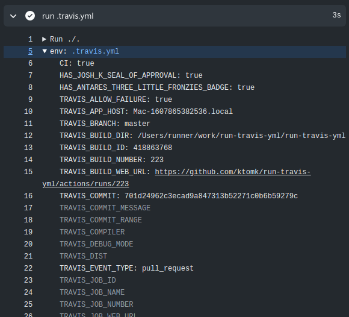

# Run .travis.yml Github Action

[![CI Status][badge.svg]](https://github.com/ktomk/run-travis-yml/actions)

For the [pipelines project][p] there was need to migrate from travis-ci.org
to travis-ci.com (as travis-ci.org is shutting down).

> **Pro-Tip:** Do not migrate from travis-ci.org to travis-ci.com, but
> look for other migration options first.

Turned out it is good to have some more options to execute the `.travis.yml`
based build script as well on Github via Github Actions.

Extracting parts of the open-source interface of Travis-CI from
[`travis-build`][TRAVIS-BUILD] as a *Github Action* to make the
`.travis.yml` more portable to Github w/o changing everything at once
and a smoother migration.

[Example](#example)
| [Usage](#usage)
| [Notes](#notes)
| [Copying](#copying)
| [Resources](#resources)

## Example

This projects [`.travis.yml`](.travis.yml) [running as Github Action][example-run]:

[][example-run]

<!-- FIXME(tk) stale link, gone after 90 days from 2020-12-13 due to log retention -->
[example-run]: https://github.com/ktomk/run-travis-yml/runs/1545656525?check_suite_focus=true#step:4:1
[example-env]: https://github.com/ktomk/run-travis-yml/runs/1545656525?check_suite_focus=true#step:4:6

## Usage

[Inputs](#inputs)
| [Outputs](#outputs)
| [Environment](#environment)

```yaml
  - name: Run .travis.yml build script
    uses: ktomk/run-travis-yml@v1
    with:
      file: .travis.yml
      steps: |
        install
        script
      allow_failure: false
    env:
      TRAVIS_PHP_VERSION: ${{ matrix.php-versions }}
```

### Inputs
* `file` (optional) Path to `.travis.yml` file (`.travis.yml` by default ).
* `steps` (optional) Steps to run as a space separated list (by default
  the following steps are run: `setup`, `before_install`, `install`,
  `before_script`, `script`, `after_script`, `before_deploy`).
* `allow_failure` (optional) Allow failure set to `true` allows build
  failures and to `false` to actually fail, which is the normal behaviour.
  This failure behaviour can also be controlled by the
  `TRAVIS_ALLOW_FAILURE` environment variable, the input overrides the
  environment variable when set. Double check cache and artifacts
  configuration for side effects and see `outputs.test_result` and
  `outputs.outcome`.
* `run_job` (optional) Name of the run-job. Possible values are the ones the
  plan is listing. By default, the original root step-scripts are in use. If
  a job has a name, it can be used as well.
* `dry_run_job` (optional) Dry-run the run-job. Possible values are `true`
  and `false`.

### Outputs
* `test_result` Outcome of `TRAVIS_TEST_RESULT`, either `0` if all commands
   in the `script` section have exited with zero or `1` otherwise.
* `conclusion` The result of the .travis.yml build after `allow_failure`
  / `TRAVIS_ALLOW_FAILURE` is applied. Possible values are `success` or
  `failure`.
* `outcome` The result of the .travis.yml build before `allow_failure`
  / `TRAVIS_ALLOW_FAILURE` is applied. Possible values are `success` or
  `failure`.

### Environment
`TRAVIS_*` environment variables are created by the action for a good start.
These defaults can always be overridden with the typical steps `env:` key,
missing ones can be added (e.g. the action can not infer the programming
languages' versions so the according `TRAVIS_*_VERSION` need to be set etc.
).

At the beginning of the action run, the current state of the `TRAVIS_*`
environment is shown for convenience. It also makes the given [defaults
visible][example-env]:

[][example-env]

Currently, three environment variables are exported, so they are available
for further job steps:

* `TRAVIS_ALLOW_FAILURE` - see `inputs.allow_failure`, `outputs.test_result`
* `TRAVIS_TEST_RESULT` - see `outputs.test_result`
* `TRAVIS_YAML_FILE` - see `inputs.file`

This also allows to run the same file multiple times, e.g. different
stages step-by-step.

## Notes
* Lightweight port to support migrating travis-ci build scripts, your
  mileage may vary.
* Run one of the build jobs as a build script based on the original
  [`travis-build`][TRAVIS-BUILD].
* Custom stages only (no matrix, deployment, after_success etc.), this needs
  additional matrix/actions in your workflow (checkout, VM setup, services,
  caching). Helps to do an actual migration, e.g. reducing matrix on Travis
  first to get build minutes down, the matrix on Github is not affected by
  that.
* Folding supported, Github just has no such nice labels thought.
* Similar on Github the timing information is not as nice as the
  one on Travis-CI.
* First error in script is annotated. If `TRAVIS_ALLOW_FAILURE` is `true`
  the annotation is a warning, not an error. Further, following output
  is folded to keep it better visible within the Github log viewer.
* Github has no allow-failure option when running action job steps. Luckily
  The ***Run .travis.yml Github Action*** has `TRAVIS_ALLOW_FAILURE`, see
  `inputs.allow_failure` as well.

### Supported / Not

This action setups environment variables specified in the `.travis.yml` file
and then runs *one* of the (potentially) many build jobs within the test
build stage. Which job to run needs to be specified by the `run_job` input,
it is not automatically selected (previous versions of the action did only
run the bare job with no environment variable support). The *plan* shows
all run-jobs in the `.travis-yml` file.

With the job to run, steps of the job (e.g. `before_install`, `install`)
etc. can be optionally specified by the `steps` input so that it is possible
to skip unwanted steps.

Travis internal steps like `setup` that would set up the virtual build
environment are not supported. Support for languages is limited, too,
insofar that there are no default steps defined, e.g. `phpunit` as `script`
for `language` `php` is not defined and if used on Travis-CI should be
added to the `.travis.yml` file explicitly to just work.

The deploy build stage is not specifically supported.

Maybe at this point it's better for orientation to write more clearly what
this action does not. Most of these limitations are by design, the action
concentrates on running the script of various build jobs first and not
setting up the virtualization environment which would require specific
knowledge of the VMs of which Github takes care of - and in a migration
needs to be done most often individually as well unless a full port of the
Travis-CI build is done, perhaps first for the Ubuntu virtual machine
environments on Github (please see [travis-build on Github][TRAVIS-BUILD]).

This may reduce the out-of-the box experience but on the other hand gives
flexibility for a migration. There are other existing Github actions that do
a better job for language specific setups or deployments than this action in
its current form could do.

* No (language specific) setup, incl. not setting up matrix specific default
  environment variables that are specific to the language
  (`TRAVIS_*_VERSION`).
* No computing platform setup (Architecture `arch`, OS `os`, Distribution
  `dist` and OSX image `osx_image`) support.
* No software installations/configurations (`compiler`, `addons`, deprecated
  `sudo`, `addons`, `cache`, `services` etc.).
* No conditionals on build script (`if`, `branches`) and in broader sense
  `exclude` - these are not evaluated. Also, yet no support for the two
  conditional steps `after_success` and `after_failure`.
* No `deploy` build stage / no deployment support. Deployments share with
 `addons`, no concept for it yet.

## Copying
`AGPL-3.0-or-later` see [COPYING], `MIT` for files from *travis-build* see
[TRAVIS-LICENSE] and `MIT` for files from *Symfony YAML* see [LICENSE].

## Resources
* [travis-ci/travis-build][TRAVIS-BUILD] - .travis.yml => build.sh converter
* [Travis Default Environment Variables][TRAVIS-ENV]
* [travis-ci/travis-yml][TRAVIS-YAML] - Travis CI build config processing
* [travis-ci/travis-conditions][TRAVIS-COND] - Boolean language for conditional builds, stages, jobs
* [travis-ci/dpl](https://github.com/travis-ci/dpl) - Dpl (dee-pee-ell) is
  a deploy tool made for continuous deployment
* [JoshCheek/travis-environment](https://github.com/JoshCheek/travis-environment
  ) - A repo to reflect on the Travis CI environment
* [Travis to GitHub Actions converter](https://akx.github.io/travis-to-github-actions/
  ) - SPA to convert Travis.yml workflows to GitHub Actions; Python and
  Node.js workflows, contributions welcome; by Aarni Koskela; Dec 2020
* [Migrating From Travis to GitHub Actions](https://markphelps.me/2019/09/migrating-from-travis-to-github-actions/)
  by Mark Phelps; Sep 2019
* [Migrate From Travis CI to GitHub Actions](https://developer.okta.com/blog/2020/05/18/travis-ci-to-github-actions)
  by Brian Demers for Okta; May 2020
* [ktomk/pipelines](https://github.com/ktomk/pipelines) - Command line
  pipeline runner written in PHP

---
[COPYING]: COPYING
[LICENSE]: lib/ktomk/symfony-yaml/Symfony/Component/Yaml/LICENSE
[TRAVIS-LICENSE]: lib/template/TRAVIS-LICENSE
[TRAVIS-BUILD]: https://github.com/travis-ci/travis-build
[TRAVIS-COND]: https://github.com/travis-ci/travis-conditions/
[TRAVIS-ENV]: https://docs.travis-ci.com/user/environment-variables/#default-environment-variables
[TRAVIS-YAML]: https://github.com/travis-ci/travis-yml
[acs]: https://github.com/travis-ci/travis-build/blob/master/lib/travis/build/stages.rb#L12-L65
[at-399]: https://github.com/actions/toolkit/issues/399
[badge.svg]: https://github.com/ktomk/run-travis-yml/workflows/CI/badge.svg
[coe]: https://docs.github.com/en/free-pro-team@latest/actions/reference/workflow-syntax-for-github-actions#jobsjob_idcontinue-on-error
[p]: https://github.com/ktomk/pipelines
